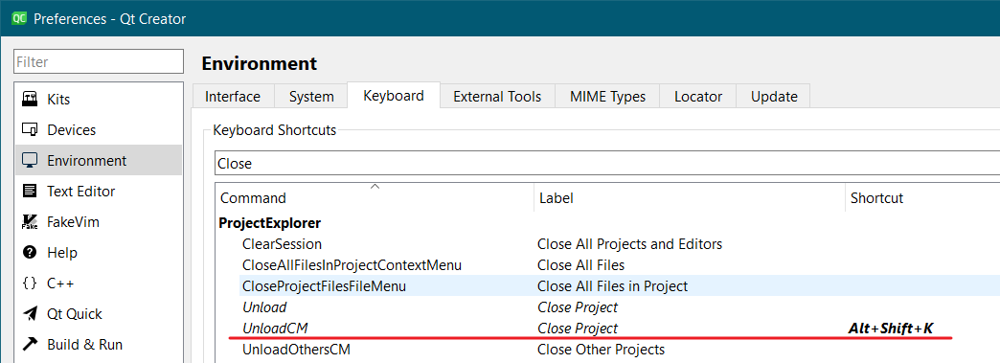

# QtcWd
A tool can quickly set the working directory of project's program running from Qt Creator.

## Usage - preparation
1. Set a useful keyboard shortcut to the command/action "UnloadCM" (labelled as "Close Project", CM means Context Menu). It is used for close your Current (not Active) project.

2. Add a useful External Tool (like "QtcWd"),
- set Executable to the path of QtcWd executable,
- set Arguments to the variable of Qtc specifying the project directory of current document (`%{CurrentDocument:Project:Path}`).

3. (Optional) After step 2, you need to click Apply or OK button to validate your external tool config. Then, you can set a useful shortcut to the external tool "QtcWd" to speed up your work.

## Usage - running
1. Open the project config file (*.pro / CMakeLists.txt) or other file of the project you want to set the working directory. Make sure the opened file is focused as Current, by mouse or keyboard.

2. Trigger your external tool QtcWd by mouse or keyboard shortcut (if you have set it).

3. Then, the project will be reopened with the new working directory config.

## App's working principle
1. Find the shortcut "Close Project" in Qtc's config file.
2. Send the shortcut to Qtc to close the current project.
3. Add a new working directory config `<value type="QString" key="RunConfiguration.WorkingDirectory">path to the project</value>` after the default config `<value type="QString" key="RunConfiguration.WorkingDirectory.default">`
4. Reopen the project.

## Build and run environment:
Tested run in:
- Qtc 13.0.2. OK.
- Qtc 12.0.2. Need to modify the code (just search "12.0.2" in project). Known issue: Qtc 12.0.2 in linux mint: cannot open project to current qtc (attach to specific pid)

Tested build environment:
- Windows: Qt 5.12.12 MSVC2017 32bit. Not supported by Qt 5.12.12 MinWG 7.3 because this MinWG does not implement the used API `GetModuleFileNameEx`.
- Linux: Qt 5.12.12 gcc 64bit.

## Other
I had summitted a suggestion (QTCREATORBUG-29798) for setting the default working directory in Qtc to Qt's bug report system, but there has been no progress for a long time. So, I made this tool to achieve a similar purpose by this simple way.